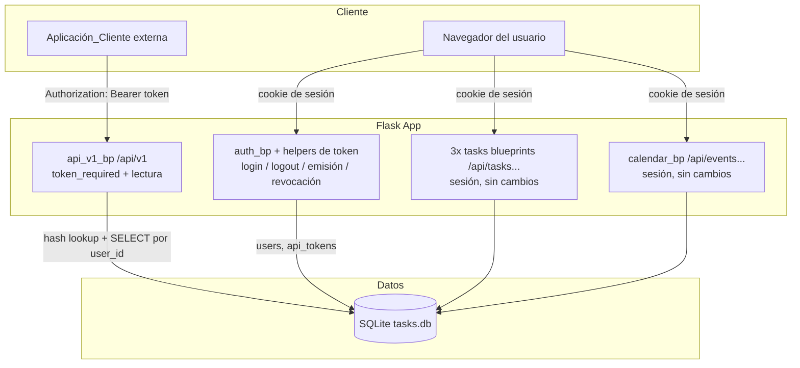
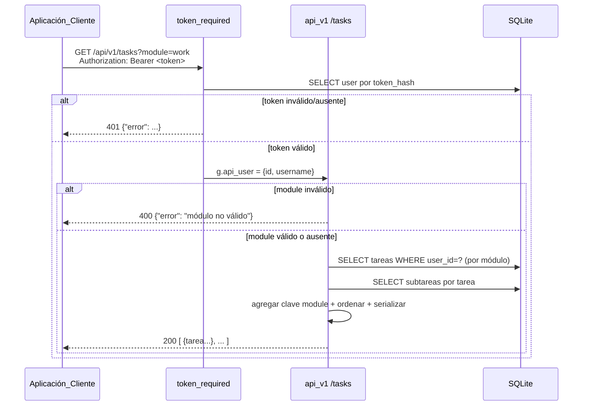

# Documento de Diseño

## Overview

Esta funcionalidad añade una **API JSON de solo lectura para consumo máquina a máquina** (`external-data-api`) a la aplicación TaskManager. Su objetivo es que una `Aplicación_Cliente` externa, sin navegador ni cookie de sesión, pueda recuperar las tareas (de los tres módulos: académico, trabajo, personal) y los eventos de calendario de un usuario concreto.

El diseño se apoya en tres piezas nuevas y en el esquema de datos ya existente:

1. **Autenticación por token de API** (Bearer): un nuevo mecanismo, independiente de la sesión de navegador, que identifica al `Usuario_Propietario` a partir de un `Token_API` opaco enviado en el encabezado `Authorization`.
2. **Emisión y revocación de tokens**: endpoints protegidos por la sesión existente que permiten al usuario logueado generar (rotar) y revocar su token, mostrando el valor en claro una única vez.
3. **Endpoints de lectura versionados** (`/api/v1/...`): un nuevo blueprint que agrega las tareas de los tres módulos y expone los eventos de calendario, con filtros y un formato de respuesta consistente.

Principio rector de compatibilidad: **nada del comportamiento existente cambia**. Los endpoints `/api/tasks`, `/api/work-tasks`, `/api/personal-tasks`, `/api/events`, etc., siguen protegidos por sesión y devuelven exactamente lo mismo que antes (Requisito 5.6). La nueva API vive bajo su propio prefijo y su propio mecanismo de autenticación.

### Decisiones clave y su justificación

| Decisión | Justificación | Requisitos |
|---|---|---|
| Prefijo nuevo `/api/v1/` para la API externa | Evita colisión con los endpoints `/api/...` de sesión y permite versionar. No toca rutas existentes. | 5.6 |
| Tabla `api_tokens` separada (no columna en `users`) | Permite guardar metadatos (creación, hash) y facilita "un token activo por usuario" sin migrar la tabla `users`. | 1.4, 2.8 |
| Token en claro se guarda **solo como hash SHA-256** | El requisito exige que el valor en claro no sea recuperable del registro. SHA-256 es adecuado y permite búsqueda O(1) (ver sección Componentes). | 1.4, 2.1 |
| `secrets.token_urlsafe(32)` para generar el token | Genera ~43 caracteres URL-safe de alta entropía (dentro del rango 32–128). | 2.1 |
| Reutilizar sesión existente para emisión/revocación | El usuario ya se autentica por navegador; la emisión es una operación de gestión de cuenta. | 2.1, 2.5 |
| Manejadores de error a nivel de blueprint (400/401/404/500) | Garantiza un sobre de error consistente sólo para la API externa, sin afectar el resto de la app. | 5.1, 5.4, 5.5 |

## Architecture

La API externa se implementa como un **nuevo blueprint** (`api_v1_bp` en un archivo `api_module.py`) más un conjunto de **ayudantes de token** ubicados en `auth.py` (junto a la lógica de usuarios ya existente). El resto de la app queda intacto.



**Separación de responsabilidades:**

- **Autenticación externa** (`token_required`): sólo la usan los endpoints de `api_v1_bp`. Lee el encabezado `Authorization`, valida el formato `Bearer <token>`, hashea el token presentado y busca el registro en `api_tokens`. Si hay coincidencia, resuelve el `Usuario_Propietario`.
- **Emisión/revocación**: rutas dentro de `auth_bp`, protegidas por `api_login_required` (sesión). No usan `token_required`.
- **Lectura**: rutas dentro de `api_v1_bp` que consultan las tablas existentes filtrando por el `user_id` resuelto por `token_required`.

### Registro en la app (`app.py`)

Se añade una línea de registro y una inicialización de tabla, sin alterar lo demás:

```python
from api_module import api_v1_bp
from auth import init_api_tokens_db  # nuevo helper en auth.py
...
app.register_blueprint(api_v1_bp)
...
# dentro de __main__, junto a las otras init:
init_auth_db()
init_api_tokens_db()   # nueva tabla api_tokens
academic_bp.init_db()
...
```

## Components and Interfaces

### 1. Ayudantes de token (en `auth.py`)

#### `init_api_tokens_db()`
Crea la tabla `api_tokens` si no existe. Se invoca en `__main__` de `app.py` después de `init_auth_db()` (necesita que exista `users` por la clave foránea).

#### `_hash_token(raw_token: str) -> str`
Devuelve el SHA-256 hex del token. Usado tanto al emitir (para guardar) como al validar (para buscar).

**Tradeoff de hashing — SHA-256 vs. Werkzeug (PBKDF2/scrypt):**
- Werkzeug (`generate_password_hash`) usa un *salt* aleatorio por registro. Eso es correcto para contraseñas (baja entropía, vulnerables a fuerza bruta), pero **impide la búsqueda por igualdad de hash**: habría que traer todos los tokens y comparar uno por uno (O(n) por petición).
- Un `Token_API` generado con `secrets.token_urlsafe(32)` tiene ~256 bits de entropía; no es adivinable por fuerza bruta ni diccionario. Por tanto **no necesita salt** y podemos usar un hash rápido y determinista (SHA-256) que permite indexar la columna y hacer una búsqueda **O(1)** por igualdad.
- **Decisión:** SHA-256 hex, columna `token_hash` con índice `UNIQUE`. Cumple 1.4 (el valor en claro no es recuperable del registro) y permite validación en una sola consulta indexada.

#### `generate_api_token(user_id: int) -> str`
1. Genera `raw = secrets.token_urlsafe(32)`.
2. Calcula `token_hash = _hash_token(raw)`.
3. En una **única transacción**: borra cualquier token previo del `user_id` (rotación / un token activo por usuario, Req 2.3, 2.8) e inserta el nuevo `(user_id, token_hash, created_at)`.
4. Si algo falla, hace `rollback` y propaga el error sin dejar estado a medias (Req 2.7).
5. Devuelve `raw` (el llamador lo muestra una sola vez).

#### `revoke_api_token(user_id: int) -> bool`
Borra la fila de `api_tokens` del usuario. Devuelve `True` si había un token, `False` si no había ninguno (Req 2.6).

#### `resolve_token_user(auth_header: str | None) -> dict | None`
Función pura de resolución usada por el decorador:
1. Si `auth_header` es `None` o no empieza por `Bearer ` → retorna `None` (formato inválido / ausente, Req 1.2, 1.6).
2. Extrae `raw = auth_header[len("Bearer "):]`. Si `raw` está vacío o sólo espacios → `None` (Req 1.5, 1.6).
3. Calcula `token_hash` y busca en `api_tokens`. Si no hay coincidencia → `None` (Req 1.3).
4. Si hay coincidencia, hace `JOIN` con `users` y retorna `{id, username}` del `Usuario_Propietario` (Req 1.1).

#### `token_required(fn)` (decorador)
```python
def token_required(fn):
    @wraps(fn)
    def wrapper(*args, **kwargs):
        user = resolve_token_user(request.headers.get("Authorization"))
        if user is None:
            return jsonify({"error": "Token de API inválido o ausente"}), 401
        g.api_user = user
        return fn(*args, **kwargs)
    return wrapper
```
Guarda el usuario resuelto en `flask.g.api_user` para que los endpoints filtren por `g.api_user["id"]`.

### 2. Endpoints de emisión/revocación (en `auth_bp`, protegidos por sesión)

| Método | Ruta | Descripción | Req |
|---|---|---|---|
| `POST` | `/api/token` | Genera (o rota) el token del usuario en sesión. Devuelve `{"token": "<claro>"}` una sola vez. | 2.1, 2.3 |
| `DELETE` | `/api/token` | Revoca el token activo del usuario en sesión. | 2.4, 2.6 |

Notas:
- Ambos usan `@api_login_required` (401 JSON si no hay sesión, Req 2.5).
- No existe ningún endpoint para leer el token en claro después de la emisión (Req 2.2): el sistema simplemente no lo ofrece porque en la base sólo está el hash.
- `POST` en error de generación/almacenamiento devuelve 500 con `error` y no modifica el token previo (Req 2.7).
- `DELETE` sin token activo devuelve 404 con `error` indicando que no hay token que revocar (Req 2.6).

### 3. Endpoints de lectura (en `api_v1_bp`, protegidos por token)

| Método | Ruta | Filtros | Descripción | Req |
|---|---|---|---|---|
| `GET` | `/api/v1/tasks` | `?module=academic\|work\|personal` (opcional) | Lista tareas de uno o los tres módulos, con subtareas. | 3.* |
| `GET` | `/api/v1/events` | `?month=YYYY-MM` (opcional) | Lista eventos de calendario del usuario. | 4.* |

#### Agregación de los tres módulos de tareas (`GET /api/v1/tasks`)

El reto es que las tareas viven en tres pares de tablas distintos. La estrategia:

1. Definir un mapa estático de módulos a tablas:
   ```python
   TASK_MODULES = {
       "academic": ("tasks", "subtasks"),
       "work": ("work_tasks", "work_subtasks"),
       "personal": ("personal_tasks", "personal_subtasks"),
   }
   ```
2. Determinar qué módulos consultar:
   - Si `?module` está presente y **no** es una clave válida → 400 con `error` (Req 3.9).
   - Si es válida → sólo ese módulo (Req 3.6).
   - Si está ausente → los tres módulos (Req 3.7).
3. Para cada módulo elegido: `SELECT` de las tareas del usuario (`WHERE user_id = ?`), y para cada tarea sus subtareas (`ORDER BY id ASC`). A cada tarea se le añade la clave `"module"`.
4. Concatenar los resultados de los módulos y ordenar la lista final por `created_at ASC`, y ante empate por `id ASC` (Req 3.1). El orden se aplica **sobre la lista agregada**, no por módulo, para que un único stream ordenado sea coherente.
5. Serializar cada tarea con exactamente las claves de la sección Data Models, forzando `null` en campos opcionales ausentes (Req 3.3) y `[]` en subtareas ausentes (Req 3.5).



## Data Models

### Tabla nueva: `api_tokens`

```sql
CREATE TABLE IF NOT EXISTS api_tokens (
    id          INTEGER PRIMARY KEY AUTOINCREMENT,
    user_id     INTEGER NOT NULL UNIQUE,      -- un token activo por usuario (Req 2.8)
    token_hash  TEXT    NOT NULL UNIQUE,       -- SHA-256 hex; el claro no es recuperable (Req 1.4)
    created_at  TEXT    DEFAULT (datetime('now')),
    FOREIGN KEY (user_id) REFERENCES users (id) ON DELETE CASCADE
);
```

- `user_id UNIQUE`: refuerza a nivel de esquema que sólo hay un token activo por usuario; la rotación borra el anterior antes de insertar (Req 2.3, 2.8).
- `token_hash UNIQUE` + búsqueda por igualdad → validación O(1).
- No existe columna con el valor en claro (Req 1.4).

### Modelo de respuesta: Tarea (`GET /api/v1/tasks`)

```json
{
  "id": 12,
  "title": "Entregar informe",
  "description": null,
  "due_date": "2026-05-01",
  "complexity": 3,
  "subject": null,
  "created_at": "2026-04-01 10:00:00",
  "module": "work",
  "subtasks": [
    { "id": 5, "title": "Redactar", "completed": false }
  ]
}
```

Reglas de serialización:
- Claves de tarea siempre presentes: `id`, `title`, `description`, `due_date`, `complexity`, `subject`, `created_at`, `module`, `subtasks` (Req 3.2).
- Campos opcionales ausentes se emiten como `null`, no se omiten (Req 3.3).
- `subtasks` siempre presente; lista vacía si no hay subtareas (Req 3.5). Cada subtarea expone `id`, `title`, `completed` (booleano), ordenadas por `id ASC` (Req 3.4).
- `completed` se normaliza de `0/1` (SQLite) a `false/true`.

### Modelo de respuesta: Evento (`GET /api/v1/events`)

```json
{
  "id": 7,
  "title": "Feriado",
  "description": null,
  "event_date": "2026-05-01",
  "module": "general",
  "created_at": "2026-04-01 09:00:00"
}
```

- Claves: `id`, `title`, `description`, `event_date`, `module`, `created_at` (Req 4.2).
- Orden: `event_date ASC`, empate por `id ASC` (Req 4.3).

### Sobre de error (todas las respuestas de error de la API externa)

```json
{ "error": "descripción legible" }
```

Con `Content-Type: application/json` y el código de estado correspondiente (400/401/404/500).

## Correctness Properties

*Una propiedad es una característica o comportamiento que debe cumplirse en todas las ejecuciones válidas del sistema; en esencia, una afirmación formal sobre lo que el sistema debe hacer. Las propiedades sirven de puente entre las especificaciones legibles por humanos y las garantías de corrección verificables por máquina.*

Las siguientes propiedades se derivan de los criterios de aceptación (ver prework). Se probarán con generadores que crean usuarios, tareas, subtareas y eventos aleatorios sobre una base SQLite en memoria, de modo que cubran el amplio espacio de entradas de forma barata (funciones puras + lecturas, sin llamadas externas).

### Property 1: Round-trip de emisión y aceptación del token

*Para todo* usuario, si se emite un `Token_API` con `generate_api_token` y se presenta como `Authorization: Bearer <token_en_claro>`, entonces la resolución identifica exactamente a ese usuario como `Usuario_Propietario`.

**Validates: Requirements 1.1, 1.5, 2.1, 2.8**

### Property 2: Longitud del token emitido

*Para todo* usuario, el `Token_API` en claro devuelto por la emisión tiene una longitud de entre 32 y 128 caracteres, ambos inclusive.

**Validates: Requirements 2.1**

### Property 3: Rechazo de credenciales inválidas

*Para toda* entrada de autenticación que sea un encabezado ausente, un esquema distinto de `Bearer`, un `Bearer` con token vacío o sólo espacios, o un token que no corresponde a ningún registro almacenado, la resolución no identifica a ningún usuario y el endpoint responde 401 con un cuerpo JSON que incluye `error`.

**Validates: Requirements 1.2, 1.3, 1.6**

### Property 4: El valor en claro del token no es recuperable del registro

*Para todo* `Token_API` emitido, el registro almacenado no contiene el valor en claro en ninguna columna y su `token_hash` es igual al hash determinista del claro (y distinto del claro).

**Validates: Requirements 1.4**

### Property 5: La rotación invalida el token anterior

*Para todo* usuario que ya posee un `Token_API` T1, tras emitir un nuevo token T2 el usuario tiene exactamente un token activo: presentar T2 identifica al usuario y presentar T1 es rechazado con 401.

**Validates: Requirements 2.3, 2.8**

### Property 6: La revocación invalida el token

*Para todo* usuario con un `Token_API` activo T, tras revocarlo la presentación de T es rechazada con 401 y no queda ningún registro de token para ese usuario.

**Validates: Requirements 2.4**

### Property 7: Aislamiento y orden de las tareas por propietario

*Para todo* conjunto de tareas pertenecientes a varios usuarios, la lista devuelta a un token contiene únicamente tareas cuyo `user_id` coincide con el `Usuario_Propietario`, y está ordenada de forma ascendente por `created_at` y, ante empate, por `id`.

**Validates: Requirements 3.1, 5.2**

### Property 8: Serialización completa de la tarea con opcionales nulos

*Para toda* tarea devuelta, el objeto JSON contiene siempre las claves `id`, `title`, `description`, `due_date`, `complexity`, `subject`, `created_at`, `module` y `subtasks`; y cualquier campo opcional sin valor almacenado (`description`, `due_date`, `subject`, `complexity`) aparece con valor nulo manteniendo la clave presente.

**Validates: Requirements 3.2, 3.3**

### Property 9: Inclusión y orden de subtareas

*Para toda* tarea devuelta, su clave `subtasks` es una lista (vacía si no tiene subtareas) en la que cada subtarea expone `id`, `title` y `completed`, y las subtareas están ordenadas de forma ascendente por `id`.

**Validates: Requirements 3.4, 3.5**

### Property 10: Filtrado de tareas por módulo

*Para todo* estado de datos: si la petición especifica un `Modulo_Tareas` válido, todas las tareas devueltas pertenecen a ese módulo; si no especifica módulo, el conjunto devuelto es exactamente la unión de las tareas del usuario en los tres módulos (`academic`, `work`, `personal`).

**Validates: Requirements 3.6, 3.7**

### Property 11: Módulo de tareas no válido

*Para toda* cadena de módulo distinta de `academic`, `work` y `personal`, la petición de lista de tareas responde 400 con un cuerpo JSON que incluye `error` y no devuelve ninguna tarea.

**Validates: Requirements 3.9**

### Property 12: Aislamiento, serialización y orden de los eventos

*Para todo* conjunto de eventos pertenecientes a varios usuarios, la lista devuelta a un token contiene únicamente eventos del `Usuario_Propietario`, cada uno con las claves `id`, `title`, `description`, `event_date`, `module` y `created_at`, ordenados de forma ascendente por `event_date` y, ante empate, por `id`.

**Validates: Requirements 4.1, 4.2, 4.3, 5.2**

### Property 13: Filtrado de eventos por mes

*Para todo* mes en formato `YYYY-MM` válido, todos los eventos devueltos tienen una `event_date` que pertenece a ese mes.

**Validates: Requirements 4.4**

### Property 14: Mes con formato no válido

*Para toda* cadena de mes con un formato distinto de `YYYY-MM`, la petición de eventos responde 400 con un cuerpo JSON que incluye `error` y no devuelve ningún evento.

**Validates: Requirements 4.7**

### Property 15: Content-Type y forma de la colección

*Para toda* respuesta de la API externa, el encabezado `Content-Type` es `application/json`; y para toda respuesta exitosa de recuperación de una colección el estado es 200 y el elemento raíz es una lista cuya longitud coincide con el número de recursos que cumplen el filtro (lista vacía cuando no hay ninguno).

**Validates: Requirements 5.1, 5.2, 5.3**

## Error Handling

Todos los errores de la API externa comparten el mismo sobre `{"error": "..."}` con `Content-Type: application/json`. El manejo se concentra en el blueprint `api_v1_bp` mediante manejadores registrados a nivel de blueprint, de modo que **no afectan** al resto de la aplicación (Req 5.6).

| Situación | Estado | Cuerpo | Requisito | Dónde se maneja |
|---|---|---|---|---|
| Falta el token / formato inválido / token desconocido | 401 | `{"error": "Token de API inválido o ausente"}` | 1.2, 1.3, 1.6 | Decorador `token_required` |
| Emisión/revocación sin sesión | 401 | `{"error": "No autorizado"}` | 2.5 | `api_login_required` (existente) |
| Revocar sin token activo | 404 | `{"error": "No hay un token activo para revocar"}` | 2.6 | Endpoint `DELETE /api/token` |
| `?module` no válido | 400 | `{"error": "Módulo no válido: ..."}` | 3.9 | Endpoint `GET /api/v1/tasks` |
| `?month` con formato distinto de `YYYY-MM` | 400 | `{"error": "El parámetro month debe tener formato YYYY-MM"}` | 4.7 | Endpoint `GET /api/v1/events` |
| Ruta inexistente bajo la API externa | 404 | `{"error": "Recurso no encontrado"}` | 5.4 | `@api_v1_bp.errorhandler(404)` |
| Fallo de emisión/almacenamiento del token | 500 | `{"error": "No se pudo emitir el token"}` | 2.7 | `try/except` + `rollback` en `generate_api_token` |
| Error de servidor inesperado en la API externa | 500 | `{"error": "Ocurrió un error interno del servidor"}` | 5.5 | `@api_v1_bp.errorhandler(Exception)` |

Consideraciones:
- **Validación del `month`**: se valida con un patrón estricto `^\d{4}-\d{2}$` y comprobando que el mes esté en 01–12, antes de tocar la base de datos (Req 4.7).
- **Atomicidad de la emisión** (Req 2.7): `generate_api_token` ejecuta el borrado del token previo y la inserción del nuevo dentro de una única transacción; ante cualquier excepción hace `rollback`, dejando intacto el token anterior, y el endpoint devuelve 500.
- **Sólo lectura**: los endpoints de datos no modifican estado, por lo que un error 500 durante una consulta no puede dejar datos a medias (satisface la cláusula de "no aplicar modificaciones" de Req 5.5).
- Los manejadores de 404/500 se registran con `api_v1_bp.errorhandler(...)` para que sólo capturen dentro del contexto de este blueprint; el 404 global de Flask (páginas HTML) no cambia.

## Testing Strategy

### Enfoque dual

- **Pruebas unitarias / de ejemplo**: casos concretos, de configuración y de borde puntual (headers sin sesión, ausencia de endpoint de lectura del claro, ruta inexistente, fallo simulado con mock).
- **Pruebas basadas en propiedades (PBT)**: validan las propiedades universales de la sección Correctness Properties sobre un amplio espacio de entradas generadas.

Ambos enfoques son complementarios: las unitarias fijan comportamientos concretos y las de propiedad cubren la generalidad.

### PBT: aplicabilidad y herramienta

Esta funcionalidad **sí** es adecuada para PBT: la resolución de tokens (round-trip emisión→resolución), el hashing (relación determinista), la agregación/serialización de tareas y eventos y el filtrado/orden son lógica con comportamiento que varía significativamente con la entrada. Las porciones de infraestructura (que los endpoints de sesión existentes no cambien) se cubren con pruebas de regresión, no con PBT.

- **Librería**: [Hypothesis](https://hypothesis.readthedocs.io/) para Python. No se implementa PBT desde cero.
- **Base de datos**: SQLite en memoria (o archivo temporal) inicializada con `init_auth_db`, `init_api_tokens_db` y los `init_db` de los módulos, poblada por los generadores. Esto mantiene cada iteración barata.
- **Configuración**: mínimo **100 iteraciones** por prueba de propiedad (`@settings(max_examples=100)`).
- **Etiquetado**: cada prueba de propiedad lleva un comentario con el formato
  `# Feature: external-data-api, Property {número}: {texto de la propiedad}`.
- **Correspondencia**: cada propiedad de la sección Correctness Properties se implementa con **una única** prueba basada en propiedades.

### Generadores (estrategias) previstos

- **Usuarios**: nombres únicos aleatorios insertados en `users`.
- **Tareas**: `title` no vacío; `description`, `due_date`, `subject`, `complexity` opcionalmente `None` para ejercitar la Property 8; `module` elegido entre los tres; `created_at` variado (incluyendo empates) para ejercitar el orden de la Property 7.
- **Subtareas**: cantidad entre 0 y N por tarea, `id` en orden arbitrario de inserción para ejercitar el orden de la Property 9.
- **Eventos**: `event_date` en varios meses y con empates para ejercitar el orden/filtrado de las Properties 12 y 13.
- **Entradas inválidas**: headers de autorización mal formados y tokens inexistentes (Property 3); cadenas de módulo no válidas (Property 11); cadenas de mes no válidas (Property 14).

### Pruebas de ejemplo / integración (no PBT)

- Emisión sin sesión → 401; revocación sin sesión → 401 (Req 2.5).
- Revocar sin token activo → 404 (Req 2.6).
- No existe endpoint que devuelva el token en claro tras la emisión (Req 2.2).
- Ruta inexistente `/api/v1/...` → 404 con `error` (Req 5.4).
- Error inesperado simulado con `mock` que lanza en la consulta → 500 con `error` (Req 5.5).
- Fallo de almacenamiento simulado durante la emisión → 500 y token previo intacto (Req 2.7).
- **Regresión de compatibilidad (Req 5.6)**: para peticiones idénticas, `/api/tasks`, `/api/work-tasks`, `/api/personal-tasks` y `/api/events` (con sesión) devuelven el mismo estado, `Content-Type` y cuerpo que antes de introducir la API externa.

### Trazabilidad propiedad → requisito

| Propiedad | Requisitos |
|---|---|
| 1 | 1.1, 1.5, 2.1, 2.8 |
| 2 | 2.1 |
| 3 | 1.2, 1.3, 1.6 |
| 4 | 1.4 |
| 5 | 2.3, 2.8 |
| 6 | 2.4 |
| 7 | 3.1, 5.2 |
| 8 | 3.2, 3.3 |
| 9 | 3.4, 3.5 |
| 10 | 3.6, 3.7 |
| 11 | 3.9 |
| 12 | 4.1, 4.2, 4.3, 5.2 |
| 13 | 4.4 |
| 14 | 4.7 |
| 15 | 5.1, 5.2, 5.3 |

Los requisitos no cubiertos por propiedades (2.2, 2.5, 2.6, 2.7, 5.4, 5.5, 5.6) se validan con las pruebas de ejemplo/integración enumeradas arriba.
